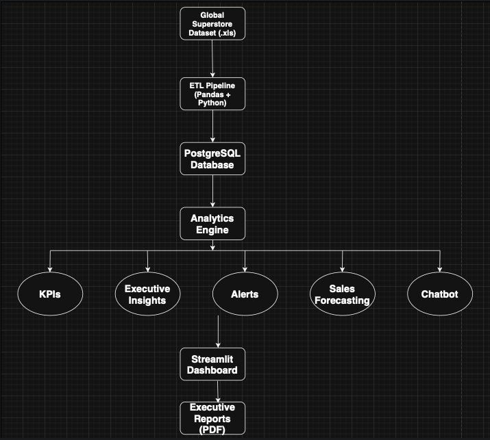
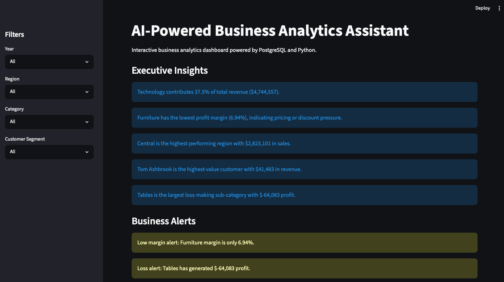
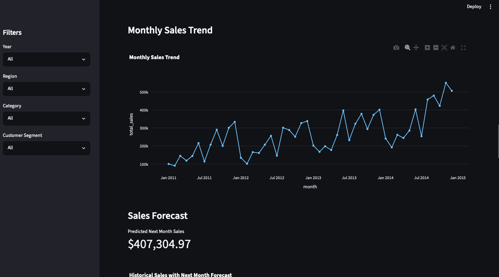
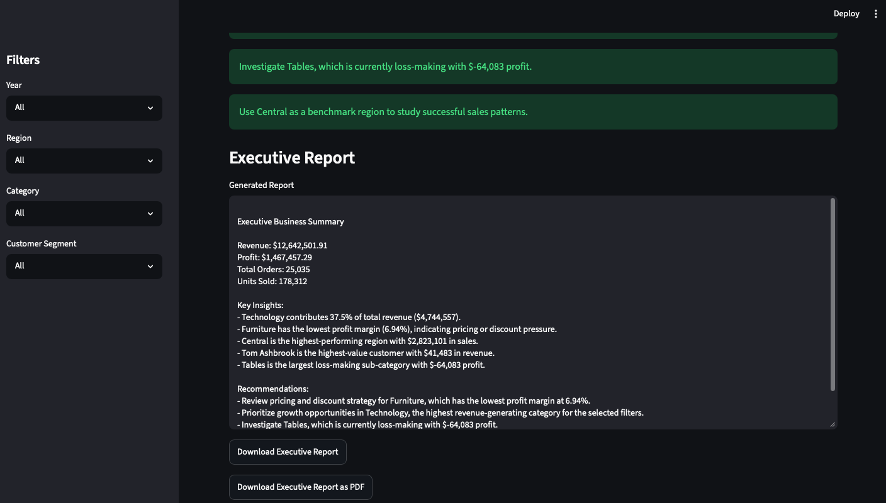
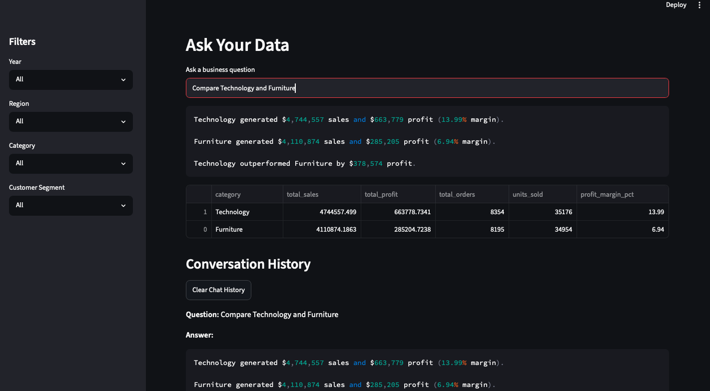

# AI-Powered Business Analytics Assistant

A production-style business intelligence platform that combines data engineering, SQL analytics, predictive analytics, reporting automation, and containerized deployment.

Built using Python, PostgreSQL, Streamlit, SQL, Docker, and predictive analytics techniques, the platform enables business users to monitor KPIs, identify risks, generate executive reports, forecast future sales, and interact with their data through a chatbot interface.

---

## Overview

This project uses the Global Superstore dataset to simulate a real-world analytics workflow:

- Ingest and transform raw business data
- Store structured data in PostgreSQL
- Generate business KPIs and performance metrics
- Produce executive insights and alerts
- Forecast future sales trends
- Support natural-language business queries
- Generate downloadable executive reports
- Containerize and deploy the platform using Docker and Docker Compose

---

## Project Highlights

- Processed 51,290 sales transactions across 25,035 unique orders
- Designed a PostgreSQL data warehouse with 6 relational tables
- Built an interactive analytics dashboard with KPI monitoring and executive reporting
- Implemented sales forecasting using Linear Regression
- Developed a rule-based analytics chatbot for business queries
- Deployed a multi-container architecture using Docker Compose with PostgreSQL and Streamlit services

---

## Architecture



---

## Dataset

Source: Global Superstore Dataset

- 51,290 transaction records
- 25,035 unique orders
- 1,590 customers
- 10,292 products
- Multiple global markets and regions

The dataset simulates a multinational retail business and is used for KPI analysis, forecasting, customer insights, and executive reporting.

---

## Key Features

### KPI Dashboard

- Revenue tracking
- Profit monitoring
- Order volume analysis
- Unit sales reporting
- Interactive filters by year, region, category, and customer segment

### Executive Insights

- Automated business observations
- Category performance analysis
- Regional performance evaluation
- Customer value analysis

### Business Alerts

- Low-margin detection
- Loss-making category identification
- Performance anomaly monitoring

### Sales Forecasting

- Monthly sales trend analysis
- Next-month sales prediction using Linear Regression
- Forecast visualization

### Analytics Chatbot

The chatbot maps natural-language business questions to analytics functions and returns data-driven insights directly from the PostgreSQL-backed analytics engine.

Sample questions:

- Which year had the highest sales?
- Which month had the highest profit?
- Compare Technology and Furniture
- Did sales grow from 2013 to 2014?
- Forecast next month sales

### Executive Reporting

- Automated business summaries
- Strategic recommendations
- Downloadable PDF reports

---

## Dashboard Screenshots

### Dashboard Overview



### Sales Forecasting



### Executive Report



### Analytics Chatbot



---

## Technology Stack

### Data Engineering

- Python
- Pandas
- SQLAlchemy

### Database

- PostgreSQL

### Analytics

- SQL
- Business KPI Analysis
- Executive Insight Generation
- Forecasting

### Machine Learning

- Scikit-Learn
- Linear Regression

### Visualization

- Plotly
- Streamlit

### Reporting

- ReportLab

### Deployment

- Docker
- Docker Compose

---

## Project Structure

```text
AI-Analytics-Assistant/
│
├── app/
│   └── dashboard.py
│
├── data/
│   └── raw/
│       └── Global Superstore.xls
│
├── notebooks/
│   └── data_exploration.ipynb
│
├── src/
│   ├── Analytics/
│   │   ├── alerts.py
│   │   ├── chatbot.py
│   │   ├── customer_analysis.py
│   │   ├── data_loader.py
│   │   ├── database.py
│   │   ├── explanations.py
│   │   ├── forecasting.py
│   │   ├── insights.py
│   │   ├── kpis.py
│   │   ├── pdf_generator.py
│   │   ├── product_analysis.py
│   │   ├── report_generator.py
│   │   ├── sales_analysis.py
│   │   └── trends.py
│   │
│   ├── db/
│   │   ├── create_tables.sql
│   │   └── load_data.py
│   │
│   └── sql/
│       └── business_kpis.sql
│
├── screenshots/
│   ├── architecture_diagram.png
│   ├── dashboard_overview.png
│   ├── sales_forecasting.png
│   ├── executive_report.png
│   └── chatbot_comparison.png
│
├── test_analytics.py
├── test_insights.py
├── test_loader.py
├── test_products.py
├── test_report.py
│
├── docker-compose.yml
├── dockerfile
├── pyproject.toml
├── uv.lock
├── README.md
└── main.py
```

---

## Database Pipeline

```text
Global Superstore Dataset
            ↓
        ETL Pipeline
     (Pandas + Python)
            ↓
     PostgreSQL Database
            ↓
      Analytics Engine
            ↓
 KPIs | Insights | Alerts
 Forecasting | Chatbot
            ↓
    Streamlit Dashboard
            ↓
 Executive Reports (PDF)
```

---

## Running Locally

### Clone Repository

```bash
git clone <repository-url>
cd AI-Analytics-Assistant
```

### Start with Docker Compose

```bash
docker compose up -d
```

### Access Dashboard

```text
http://localhost:8501
```

### Verify Containers

```bash
docker ps
```

---

## Sample Business Questions

```text
Which year had the highest sales?
Which month had the highest profit?
Compare Technology and Furniture
Did sales grow from 2013 to 2014?
Forecast next month sales
```

---

## Future Enhancements

- LLM-powered business assistant
- Advanced forecasting models
- Customer churn prediction
- Inventory optimization analytics
- AWS cloud deployment
- Role-based user access
- Real-time dashboard updates

---

## Business Impact

This project demonstrates an end-to-end analytics workflow commonly used in modern organizations:

- Data ingestion and transformation
- Relational database design
- Business intelligence reporting
- KPI monitoring
- Forecasting
- Executive decision support
- Containerized deployment

The system is designed to emulate a production-style analytics platform rather than a standalone dashboard.

This project combines data engineering, SQL analytics, machine learning, dashboard development, reporting automation, and containerized deployment in a single end-to-end analytics platform.

---

## Author

**Tejas Pavular Ramesh**

Master of Computer Science, NC State University

Interests: Data Science, Machine Learning, Analytics Engineering, Business Intelligence, and AI Systems.